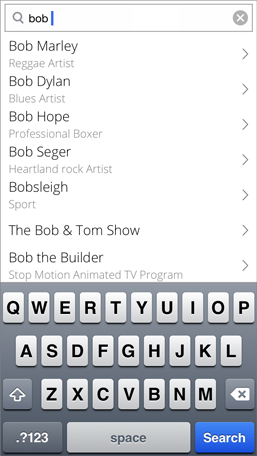
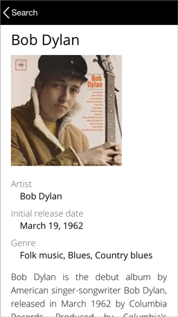
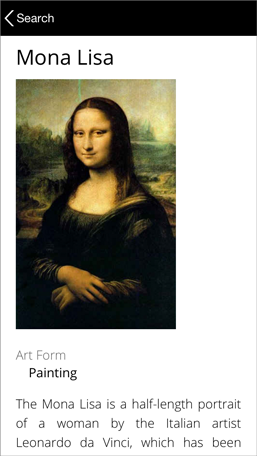

#TCKnowledgeGraph

**TCKnowledgeGraph** is a sample iOS app that uses the API provided by _Freebase_ to search and fetch topics from its giant knowledge graph. 
This app also makes use of the _Wikipedia_ API to pull in images that are currently missing from Freebase's database.

 
&nbsp;&nbsp;
&nbsp;&nbsp;
&nbsp;&nbsp; 
&nbsp;&nbsp;

###Build Requirements
<dl style="margin-left: -1em;">
  <dt>Build Requirements</dt>
  <dd>Xcode 4.6 or later, iOS 6.0 SDK or later, CocoaPods</dd>
  <dt>Runtime Requirements</dt>
  <dd>iOS 6.0 or later</dd>
</dl>

###Open Source Libraries Used
* AFNetworking - [https://github.com/AFNetworking/AFNetworking](https://github.com/AFNetworking/AFNetworking)
* MBProgressHUD - [https://github.com/jdg/MBProgressHUD](https://github.com/jdg/MBProgressHUD)
* ISO8601DateFormatter - [https://github.com/boredzo/iso-8601-date-formatter](https://github.com/boredzo/iso-8601-date-formatter)
* CocoaPods - [http://cocoapods.org/](http://cocoapods.org/)

###See Also
* Freebase - [http://www.freebase.com/](http://www.freebase.com/)
* Freebase API Docs - [https://developers.google.com/freebase/](https://developers.google.com/freebase/)
* Google Knowledge Graph - [http://www.google.com/insidesearch/features/search/knowledge.html](http://www.google.com/insidesearch/features/search/knowledge.html)
